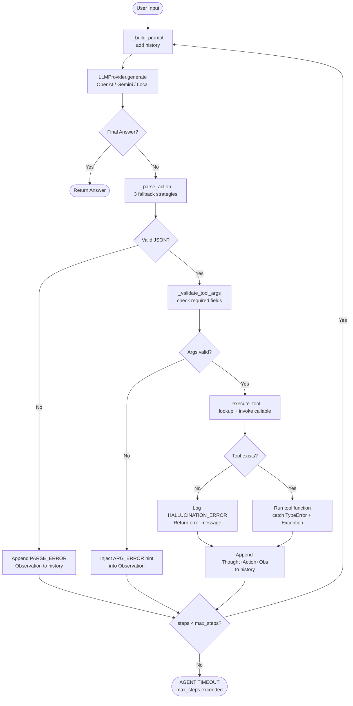
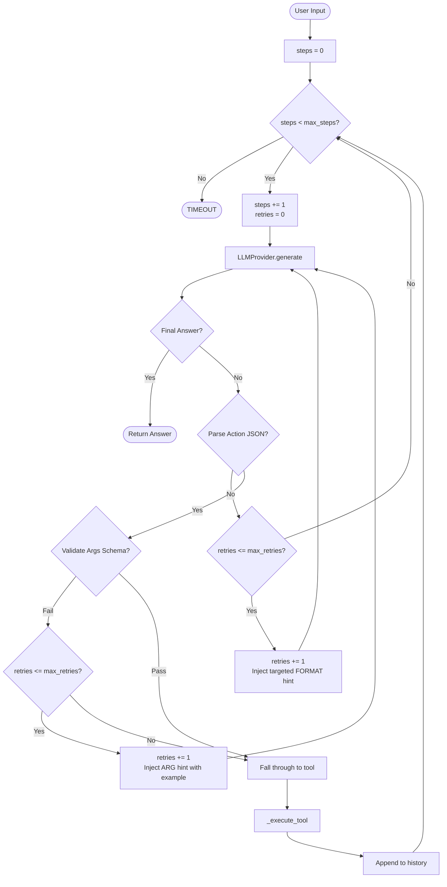
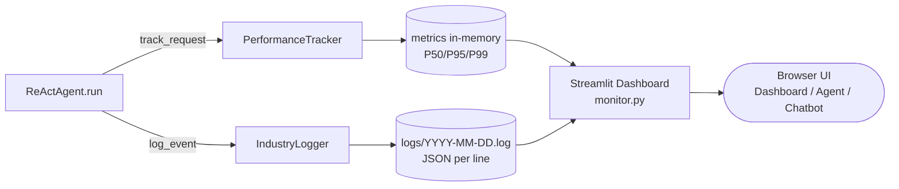

# Lab 3: Chatbot vs ReAct Agent (Industry Edition)

Welcome to Phase 3 of the Agentic AI course! This lab focuses on moving from a simple LLM Chatbot to a sophisticated **ReAct Agent** with industry-standard monitoring.

## 🚀 Getting Started

### 1. Setup Environment
Copy the `.env.example` to `.env` and fill in your API keys:
```bash
cp .env.example .env
```

### 2. Install Dependencies
```bash
pip install -r requirements.txt
```

### 3. Directory Structure
- `src/tools/`: Extension point for your custom tools.

## 🏠 Running with Local Models (CPU)

If you don't want to use OpenAI or Gemini, you can run open-source models (like Phi-3) directly on your CPU using `llama-cpp-python`.

### 1. Download the Model
Download the **Phi-3-mini-4k-instruct-q4.gguf** (approx 2.2GB) from Hugging Face:
- [Phi-3-mini-4k-instruct-GGUF](https://huggingface.co/microsoft/Phi-3-mini-4k-instruct-gguf)
- Direct Download: [phi-3-mini-4k-instruct-q4.gguf](https://huggingface.co/microsoft/Phi-3-mini-4k-instruct-gguf/resolve/main/Phi-3-mini-4k-instruct-q4.gguf)

### 2. Place Model in Project
Create a `models/` folder in the root and move the downloaded `.gguf` file there.

### 3. Update `.env`
Change your `DEFAULT_PROVIDER` and set the path:
```env
DEFAULT_PROVIDER=local
LOCAL_MODEL_PATH=./models/Phi-3-mini-4k-instruct-q4.gguf
```

## 🎯 Lab Objectives

1.  **Baseline Chatbot**: Observe the limitations of a standard LLM when faced with multi-step reasoning.
2.  **ReAct Loop**: Implement the `Thought-Action-Observation` cycle in `src/agent/agent.py`.
3.  **Provider Switching**: Swap between OpenAI and Gemini seamlessly using the `LLMProvider` interface.
4.  **Failure Analysis**: Use the structured logs in `logs/` to identify why the agent fails (hallucinations, parsing errors).
5.  **Grading & Bonus**: Follow the [SCORING.md](file:///Users/tindt/personal/ai-thuc-chien/day03-lab-agent/SCORING.md) to maximize your points and explore bonus metrics.

## 🛠️ How to Use This Baseline
The code is designed as a **Production Prototype**. It includes:
- **Telemetry**: Every action is logged in JSON format for later analysis.
- **Robust Provider Pattern**: Easily extendable to any LLM API.
- **Clean Skeletons**: Focus on the logic that matters—the agent's reasoning process.

---

## 🗺️ System Architecture

### ReAct Agent v1 — Core Loop



### ReAct Agent v2 — Per-Step Retry Loop



### Telemetry Data Flow



---

## 📁 Project Structure

```
Lab3__Team056-ritvien/
├── chatbot.py                     # Baseline chatbot (3 test cases)
├── monitor.py                     # Streamlit dashboard (4 pages)
├── src/
│   ├── agent/
│   │   ├── agent.py               # ReAct Agent v1
│   │   └── agent_v2.py            # ReAct Agent v2 (few-shot + schema validation)
│   ├── core/
│   │   ├── llm_provider.py        # Abstract base class
│   │   ├── openai_provider.py
│   │   ├── gemini_provider.py
│   │   └── local_provider.py      # Phi-3 via llama-cpp-python
│   ├── telemetry/
│   │   ├── logger.py              # JSON structured logging
│   │   └── metrics.py             # P50/P95/P99 + cost tracking
│   └── tools/
│       ├── data_access.py         # SQLite / CSV backend
│       ├── db_tool.py             # Student info query tool
│       ├── model_evaluator.py     # LLM-based grader tool
│       └── scoring_engine.py      # Score computation tool
├── experiments/
│   ├── ablation_study.py          # v1 vs v2 comparison script
│   └── results/
│       └── ablation_results.md    # Pre-captured results
├── logs/
│   └── sample_trace_2026-06-01.log  # Sample runtime trace (JSON)
├── scripts/
│   └── init_db.py                 # Initialize SQLite from CSV
├── tests/
│   ├── test_react_agent.py
│   └── test_local.py
└── report/
    └── group_report/
        └── GROUP_REPORT_Team056.md
```

---

*Happy Coding! Let's build agents that actually work.*
